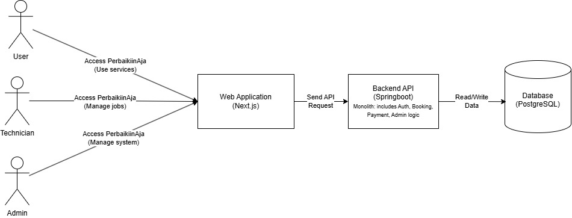

# PerbaikiinAja-be

## Deliverable G.1

### Context Diagram

### Container Diagram

### Deployment Diagram

## Deliverable G.2

### Future Context Diagram

### Future Container Diagram

## Deliverable G.3

### Risk Analysis dan Architecture Modification Justification

Dari context diagram saat ini, terlihat bahwa semua proses utama, baik autentikasi, manajemen pesanan, manajemen teknisi, hingga pelaporan dan pengelolaan kupon berlangsung dalam satu jalur sistem utama (PerbaikinAja System) tanpa adanya sistem pendukung yang menangani fungsi-fungsi khusus. Hal ini menimbulkan risiko beban pemrosesan terpusat yang tinggi, serta kerentanan terhadap ketidakefisienan komunikasi antar peran. Misalnya, pengiriman notifikasi kepada user dan teknisi dilakukan secara tidak eksplisit melalui sistem utama, sehingga bisa memperlambat waktu respons.

Future component diagram memberikan solusi dengan menambahkan komponen-komponen pendukung seperti Authentication System, Notification System, Payment Gateway System, dan Analytics & Reporting System yang meskipun tidak sepenuhnya menghapus sistem monolitik, berfungsi untuk melepaskan tanggung jawab-tanggung jawab tertentu dari inti sistem utama. Dengan sistem autentikasi yang berdiri sendiri, keamanan akses pengguna dapat dikontrol lebih ketat dan dapat diskalakan sesuai kebutuhan tanpa harus mengganggu layanan utama. Begitu pula dengan sistem notifikasi yang menangani pengiriman pesan secara otomatis dan terjadwal kepada user maupun teknisi, yang sebelumnya ditangani oleh sistem utama secara langsung.

Integrasi dengan Payment Gateway System juga menjadi aspek penting dalam arsitektur baru. Dalam sistem sebelumnya, metode pembayaran belum terintegrasi secara eksplisit, sehingga menimbulkan risiko kegagalan konfirmasi dan ketidakteraturan dalam pencatatan transaksi. Dengan modul pembayaran yang berdiri sendiri, sistem akan lebih tangguh terhadap kesalahan proses serta memudahkan audit dan pelacakan pembayaran.

## Payment Method

### Component Diagram

### Code Diagram

### Melihat Laporan & Mengelola Kupon

#### component diagram

#### code diagram

